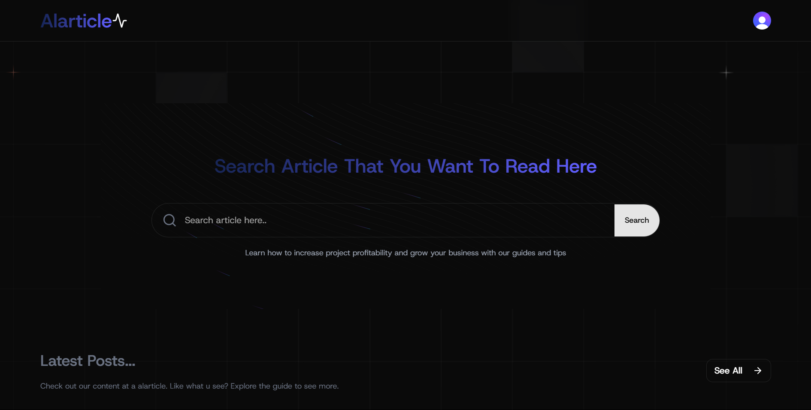

# 📖 Alarticle

**Alarticle** adalah platform modern untuk mencari dan membaca artikel dengan tampilan elegan dan pengalaman pengguna yang mulus.



## 🚀 Fitur

- 🔍 **Pencarian Artikel** – Temukan artikel dengan cepat menggunakan fitur pencarian yang responsif.
- ⚙️ **CRUD** - Hanya role admin saja yang bisa akses dashboard dan melakukan CRUD
- 💬👍 **Action** - User bisa like dan comment pada artikel
- 🎨 **Desain Modern** – UI minimalis dengan tema gelap yang menawan.
- 📱 **Responsif** – Dioptimalkan untuk tampilan desktop maupun mobile.
- 🛠️ **Dibangun dengan Next.js** – Performa tinggi dengan fitur bawaan seperti SSR dan ISR.

## 🏗️ Teknologi yang Digunakan

- **Next.js** – Framework React untuk aplikasi web yang cepat.
- **Tailwind CSS** – Styling modern dan fleksibel.
- **Aceternity UI** -- Component background pada search
- **ShadCn UI** -- Component reusable
- **Clerk** – Autentikasi pengguna yang mudah.
- **Neon PostgreSQL** – Database SQL berbasis cloud.
- **Prisma** – ORM modern untuk mengelola database.

## 📦 Instalasi

Jalankan perintah berikut untuk menjalankan proyek secara lokal:

```bash
git clone https://github.com/username/alarticle.git
cd alarticle
npm install
npm run dev
```

Akses proyek di http://localhost:3000.
